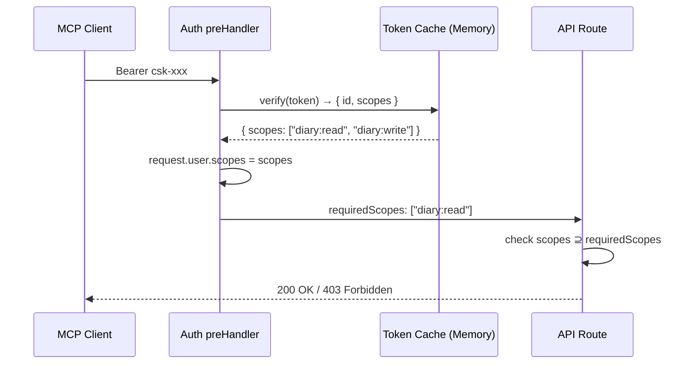

# Access Token 权限范围 (Scopes) - Design

> **Status**: Approved
> **Requirements**: [requirements.md](./requirements.md)
> **Last Updated**: 2026-03-09

## Overview

在现有 AccessToken 模块上扩展 scopes 功能，涉及数据模型、后端服务/控制器/鉴权钩子、前端 UI 四层改动。

## Architecture Overview



## Data Model

### AccessToken (修改)

```prisma
model AccessToken {
  id          String    @id @default(uuid())
  name        String
  tokenHash   String    @unique
  tokenPrefix String
  scopes      String    @default("[]")   // ← 新增，JSON 数组
  createdAt   DateTime  @default(now())
  lastUsedAt  DateTime?
}
```

## Component Design

### 1. Scope 常量定义

**新建文件**: `src/modules/access-token/scopes.ts`

```typescript
export const ACCESS_TOKEN_SCOPES = [
  "diary:read",
  "diary:write",
  "diary:export",
  "diary:import",
] as const;

export type AccessTokenScope = (typeof ACCESS_TOKEN_SCOPES)[number];

export const DEFAULT_SCOPES: AccessTokenScope[] = ["diary:read", "diary:write"];
```

### 2. TypeBox Schema 变更

**文件**: `src/types/access-token.ts`

- `SchemaAccessTokenCreate`: body 增加 `scopes: Type.Array(Type.String())`
- `SchemaAccessTokenCreateResponse`: 增加 `scopes: Type.Array(Type.String())`
- `SchemaAccessTokenListItem`: 增加 `scopes: Type.Array(Type.String())`
- 新增 `SchemaAccessTokenUpdate`: `{ id, name, scopes }`

### 3. AccessTokenService 变更

**文件**: `src/modules/access-token/service.ts`

| 方法                       | 变更                          |
| -------------------------- | ----------------------------- |
| `create(name, scopes)`     | 校验 scopes 合法性，存入 JSON |
| `update(id, name, scopes)` | 新增方法，更新 name 和 scopes |
| `findAll()`                | 返回时解析 scopes JSON        |
| `verify()`                 | 返回 scopes（解析后数组）     |

**缓存变更**: `Map<tokenHash, string>` → `Map<tokenHash, { id: string, scopes: string[] }>`

### 4. AccessToken Controller 变更

**文件**: `src/modules/access-token/controller.ts`

| 路由                         | 变更                         |
| ---------------------------- | ---------------------------- |
| `POST /access-tokens`        | body 增加 scopes             |
| `GET /access-tokens`         | 响应包含 scopes              |
| `POST /access-tokens/update` | **新增**，修改 name + scopes |
| `DELETE /access-tokens/:id`  | 不变                         |

### 5. Auth Hook 变更

**文件**: `src/modules/auth/controller.ts`

扩展类型声明：

```typescript
interface FastifyContextConfig {
  disableAuth?: boolean;
  requireAdmin?: boolean;
  requiredScopes?: string[]; // 新增
}

interface FastifyJWT {
  user: {
    id: string;
    username: string;
    role: string;
    source?: string;
    scopes?: string[]; // 新增
  };
}
```

preHandler 逻辑追加：

```
if source === "access-token" && requiredScopes 存在:
  check user.scopes ⊇ requiredScopes
  不满足 → throw ErrorForbidden
```

### 6. 路由 Scope 声明

| 路由                       | requiredScopes     |
| -------------------------- | ------------------ |
| `POST /diary/getMonthList` | `["diary:read"]`   |
| `POST /diary/getDetail`    | `["diary:read"]`   |
| `POST /diary/update`       | `["diary:write"]`  |
| `POST /diary/search`       | `["diary:read"]`   |
| `POST /diary/export`       | `["diary:export"]` |
| `POST /diary/import`       | `["diary:import"]` |
| `POST /diary/statistic`    | `["diary:read"]`   |

## Error Handling

| 场景                            | 错误码 | 消息                  |
| ------------------------------- | ------ | --------------------- |
| 创建/编辑时传入非法 scope       | 400    | "Invalid scopes: xxx" |
| access-token 请求缺少所需 scope | 403    | "Insufficient scope"  |
