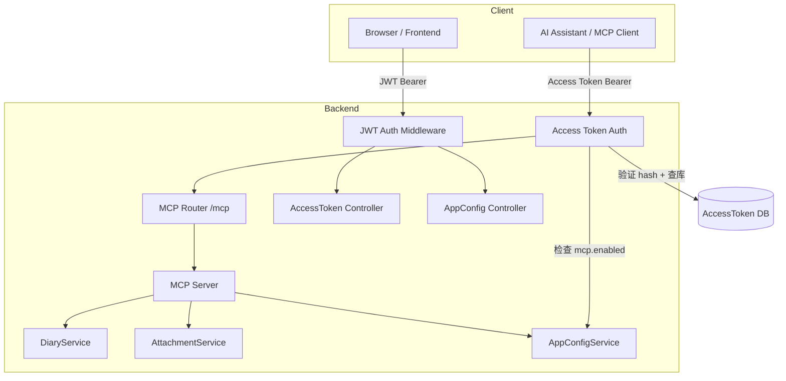
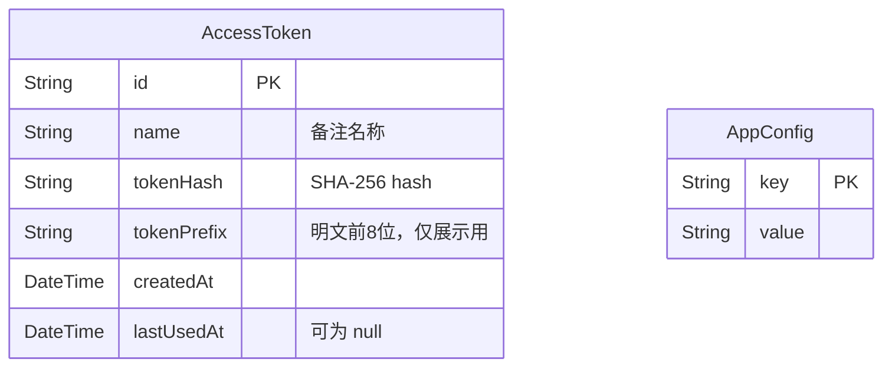

# Design: MCP 支持

## 架构概览



## 数据模型



`AppConfig` 新增 key：`mcp.enabled`，值为字符串 `"true"` / `"false"`，复用现有表，无需迁移。**默认不启用（key 不存在时视为 `false`）。**

## 组件设计

### 1. AccessToken 模块

**`modules/access-token/service.ts`**

- `create(name)` — 生成随机 token（`crypto.randomBytes(32).toString('hex')`），取前 8 位为 prefix，SHA-256 hash 存库，返回明文 token
- `findAll()` — 查所有记录，不返回 hash
- `delete(id)` — 删除记录
- `verify(plainToken)` — hash 后查库，匹配则更新 `lastUsedAt` 并返回记录，否则返回 null

**`modules/access-token/controller.ts`**

- `POST /access-tokens` — 创建，返回明文 token（唯一一次）
- `GET /access-tokens` — 列表
- `DELETE /access-tokens/:id` — 删除

### 2. MCP 模块

**`modules/mcp/server.ts`**

- 初始化 `@modelcontextprotocol/sdk` 的 `McpServer`
- 注册 6 个 tool（见下方 Tool 设计）
- 每个 tool 的 handler 直接调用对应 service 方法

**`modules/mcp/controller.ts`**

- 注册 `/mcp` 路由（POST，Streamable HTTP）
- `preHandler`：
  1. 取 `Authorization: Bearer <token>`，hash 后调 `accessTokenService.verify()`
  2. 若验证失败，返回 `401`
  3. 检查 `app-config` 的 `mcp.enabled`，若为 false，返回 `503`
- handler：将请求转发给 `McpServer.handleRequest()`

### 3. 类型定义

**`types/access-token.ts`**

```typescript
// 用 typebox 定义
SchemaAccessTokenCreate; // body: { name: string }
SchemaAccessTokenCreateResponse; // { id, name, tokenPrefix, token, createdAt }
SchemaAccessTokenListItem; // { id, name, tokenPrefix, createdAt, lastUsedAt }
```

## API 设计

### Access Token 接口

| Method   | Path                 | 说明                         |
| -------- | -------------------- | ---------------------------- |
| `POST`   | `/access-tokens`     | 创建 token，body: `{ name }` |
| `GET`    | `/access-tokens`     | 列出所有 token               |
| `DELETE` | `/access-tokens/:id` | 删除 token                   |

**创建响应示例**

```json
{
  "id": "uuid",
  "name": "Claude Desktop",
  "tokenPrefix": "a1b2c3d4",
  "token": "a1b2c3d4e5f6...（64位hex，仅此一次）",
  "createdAt": "2026-03-06T00:00:00Z"
}
```

### MCP Endpoint

| Method | Path   | 说明                          |
| ------ | ------ | ----------------------------- |
| `POST` | `/mcp` | Streamable HTTP，MCP 协议通信 |

鉴权头：`Authorization: Bearer <plainToken>`

## MCP Tool 设计

```typescript
// diary_get_month
input: { month: string }  // "YYYYMM"
output: { entries: Array<{ dateStr, content, color }> }

// diary_get_detail
input: { dateStr: string }  // "YYYYMMDD"
output: { content: string, color: string | null }

// diary_update
input: { dateStr: string, date: number, content: string, color?: string }
output: { success: boolean }

// diary_search
input: { keyword: string, page?: number }
output: { total: number, list: Array<{ dateStr, content }> }

// attachment_upload
input: { filename: string, mimeType: string, base64: string }
output: { markdownString: string }  // e.g. ""

// attachment_get_info
input: { id: string }
output: { id, filename, type, size, createdAt }
```

## 错误处理

| 场景                          | HTTP 状态码 | 说明                |
| ----------------------------- | ----------- | ------------------- |
| Access Token 不存在或验证失败 | 401         | Unauthorized        |
| `mcp.enabled` 为 false        | 503         | Service Unavailable |
| attachment_upload 超过 10MB   | 400         | File too large      |
| tool 参数校验失败             | MCP error   | Invalid params      |

## 前端页面设计

**Access Token 管理页** (`pages/access-token/`)

- Token 列表：Table 展示 name、prefix、createdAt、lastUsedAt、删除按钮
- 新建弹窗：输入 name → 调接口 → Modal 展示明文 token + 复制按钮 + "此 token 只显示一次" 警告

**MCP 设置页** (`pages/mcp-settings/`)

- MCP 开关（读写 `mcp.enabled`）
- MCP endpoint 展示：`{baseUrl}/api/mcp`
- Tip：Access Token 仅用于 MCP 接入，不可用于其他 API 请求
- 跳转到 Token 管理页的入口

## 迁移计划

1. 新增 `AccessToken` 模型到 `prisma/schema.prisma`
2. 运行 `prisma migrate dev --name add-access-token`
3. 无需现有数据迁移，`mcp.enabled` 首次读取不存在时默认为 `false`
